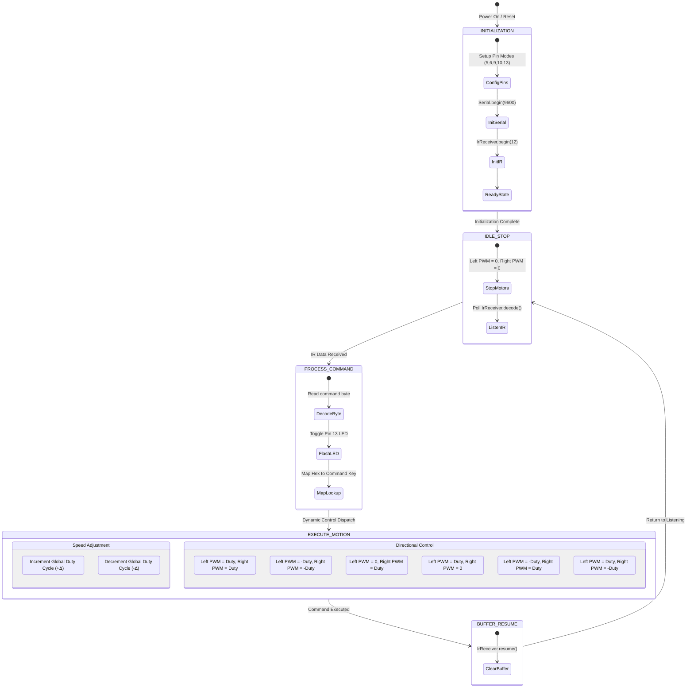
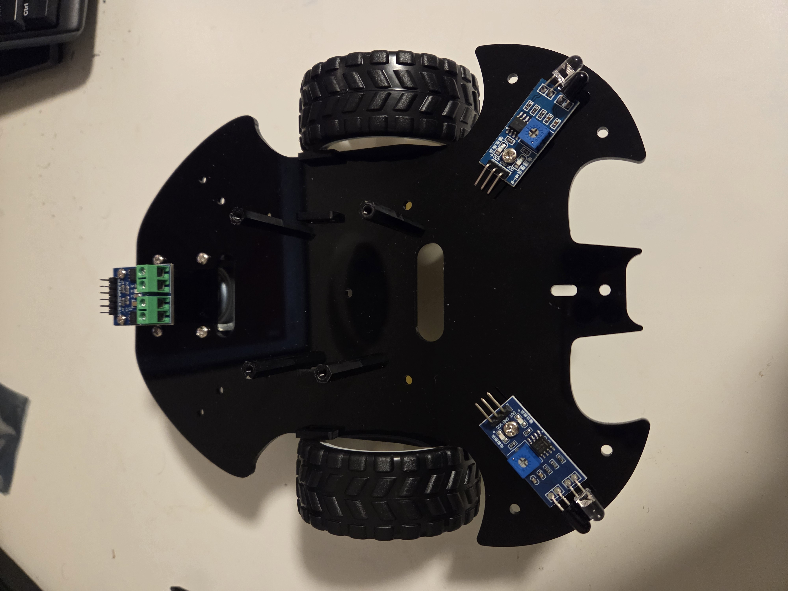
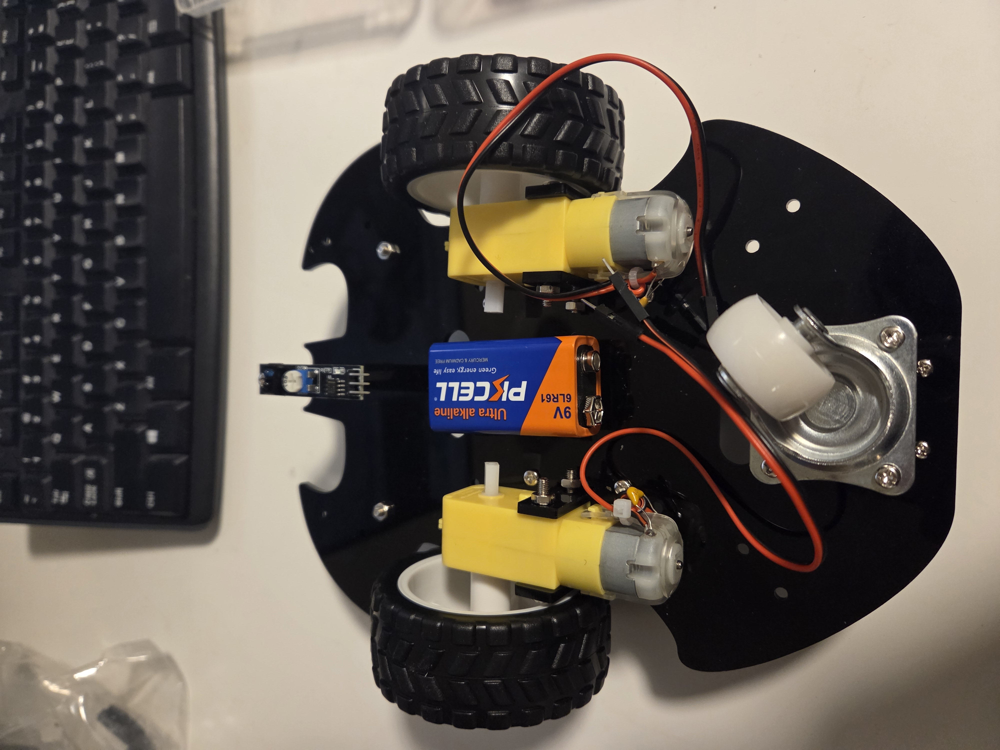
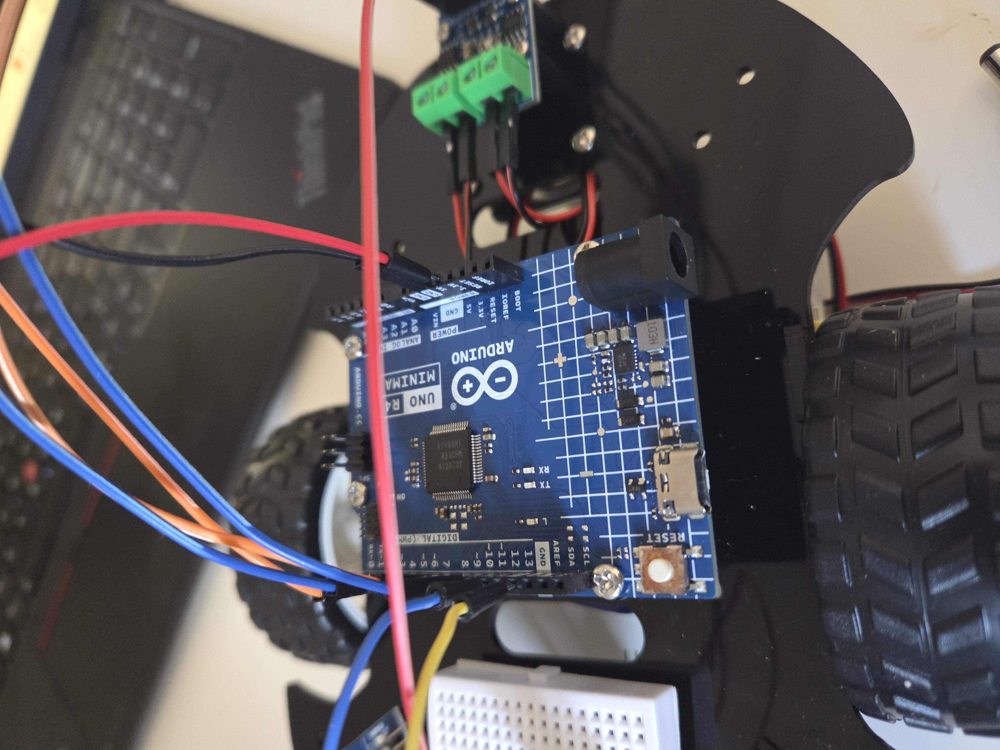
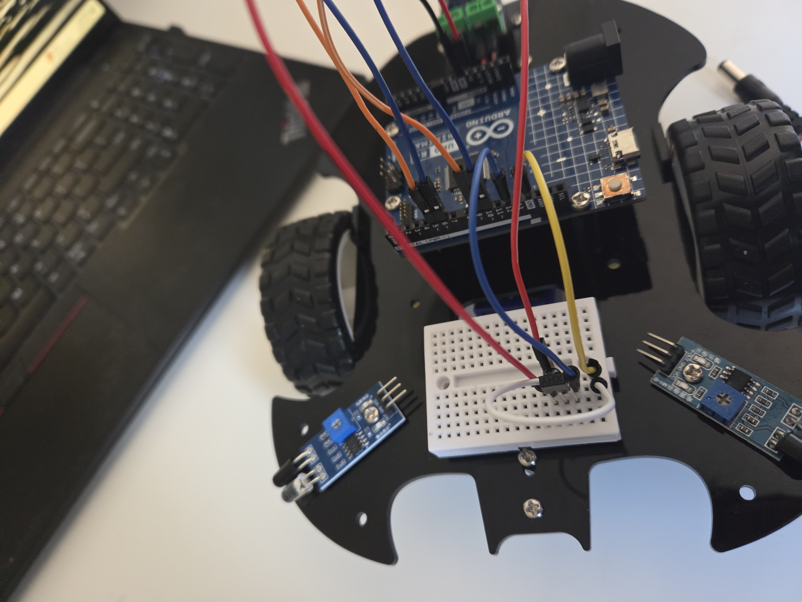

# IR-Controlled Differential-Drive Robotic Vehicle

[](https://www.arduino.cc/)
[](https://isocpp.org/)
[](https://www.ti.com)
[]()

An embedded system implementation of a differential-drive robotic vehicle operated via an 38 kHz infrared (IR) remote control. Built on the **Arduino Uno R4 Minima** platform, this project integrates low-level pulse-modulated signal decoding, H-Bridge dual-DC motor control, and dynamic velocity modulation to achieve precise real-time maneuverability.

---

## 📌 Summary

This project showcases the end-to-end electrical and software design of a wireless-controlled robotic vehicle. The system captures pulse-modulated 38 kHz infrared signals transmitted by a handheld controller, decodes the raw command frames, and maps them directly to physical differential steering dynamics and duty-cycle speed adjustments.

### Key Highlights
* **Real-Time Signal Decoding:** Operates at 38 kHz pulse-frequency with non-blocking receiver buffer clearing using the `IRremote` library.
* **Isolated Power Architecture:** Dual-power bus design separating logic electronics from high-current inductive motor loads to prevent power-rail noise and brownouts.
* **Dynamic Speed Control:** Variable PWM duty-cycle scaling with incremental acceleration and deceleration limits.
* **Robust Hardware H-Bridge Control:** Bi-directional dual DC motor driving managed by the L9110 IC driver module.

---

## 🛠️ System Architecture & Hardware Setup

### Component Breakdown
| Hardware Component | Quantity | Purpose / Description |
| :--- | :---: | :--- |
| **Arduino Uno R4 Minima** | 1 | Primary 32-bit microcontroller handling interrupt decoding, logic state handling, and PWM motor control. |
| **L9110 Dual-Channel Motor Driver** | 1 | Dual H-bridge IC regulating power delivery, polarity, and speed for two DC motors. |
| **TT DC Gear Motors** | 2 | Drivetrain motors for left and right differential vehicle actuation. |
| **38 kHz IR Receiver Module** | 1 | Optical receiver module for demodulating handheld remote IR signals. |
| **IR Handheld Remote Control** | 1 | Transmits IR pulse sequences corresponding to directional and speed commands. |
| **Status LED & 220Ω Resistor** | 1 | Visual indicator connected to Pin 13 providing instant feedback upon valid packet reception. |
| **Dedicated Motor Battery Pack** | 1 | External high-current power supply dedicated to the motor driver rail. |
| **Logic Power Supply (5V)** | 1 | Dedicated supply/USB for microcontroller and low-power sensor logic. |

---

## 🔌 Circuit & Schematic Diagram

### Power Distribution & Grounding
To maintain logic stability and mitigate ground bounce and voltage sags caused by motor startup surges:
1. **Logic Rail:** Arduino board and IR receiver powered via steady 5V source.
2. **Motor Power Rail:** L9110 driver module powered directly by external battery bank.
3. **Common Ground:** Logic ground and power ground are tied together at a single reference node (`GND`).

### Wiring Pinout Table

| Arduino Uno R4 Pin | Component Module | Pin / Functional Connection | Notes |
| :---: | :---: | :---: | :--- |
| **Pin 12** | IR Receiver Module | Signal Output (`OUT`) | Demodulated IR data input |
| **Pin 13** | External Feedback LED | Anode (`+`) | Optical command acknowledgment |
| **Pin 5** | L9110 Motor Driver | Motor A Input 1 (`A-1A`) | PWM / Direction Control (Left Motor) |
| **Pin 6** | L9110 Motor Driver | Motor A Input 2 (`A-1B`) | PWM / Direction Control (Left Motor) |
| **Pin 9** | L9110 Motor Driver | Motor B Input 1 (`B-1A`) | PWM / Direction Control (Right Motor) |
| **Pin 10** | L9110 Motor Driver | Motor B Input 2 (`B-1B`) | PWM / Direction Control (Right Motor) |
| **5V** | IR Receiver | VCC | Logic Power Supply |
| **GND** | IR Receiver / L9110 | GND | Common System Ground Reference |

### Schematic Circuit Representation

```
                    +---------------------------------------+
                    |        Dedicated Battery Pack         |
                    |                 (V_motor)             |
                    +-------------------+-------------------+
                                        | (+)         | (-)
                                        |             |
                                        v             v
+------------------+             +------+-------------+------+          +----------------+
|  IR Remote Ctrl  |             |  L9110 Motor Driver Board  |----------| Left DC Motor  |
|   (38kHz Tx)     |             |                            |          |   (TT Gear)    |
+--------+---------+             |  [ VCC_M ]       [ GND ]   |          +----------------+
         |                       +------+--------------+------+
         | (Wireless)                   |              |
         v                              |              |                 +----------------+
+--------+---------+                    |              +-----------------| Right DC Motor |
|  38kHz IR Recv   |                    |              |                 |   (TT Gear)    |
|  [ OUT Pin ]     |                    |              |                 +----------------+
+--------+---------+                    |              |
         |                              |              |
         | Signal (Pin 12)              |              |
         v                              v              v
+--------+------------------------------+--------------+---------------------------------+
|                                                                                       |
|                                ARDUINO UNO R4 MINIMA                                  |
|                                                                                       |
|   [ Pin 12 ] <--- IR Demodulated Output                                               |
|   [ Pin 13 ] ---> Status Indicator LED (+) ===[ 220Ω ]===> GND                        |
|                                                                                       |
|   [ Pin 5  ] ---> Left Motor Direction/PWM A-1A                                       |
|   [ Pin 6  ] ---> Left Motor Direction/PWM A-1B                                       |
|   [ Pin 9  ] ---> Right Motor Direction/PWM B-1A                                      |
|   [ Pin 10 ] ---> Right Motor Direction/PWM B-1B                                      |
|                                                                                       |
|   [  5V    ] ---> IR Receiver VCC                                                     |
|   [  GND   ] ---> Common Ground (IR Recv GND, L9110 GND, Battery GND)                |
+---------------------------------------------------------------------------------------+
```

---

## 🔄 Software Architecture & State Machine

The firmware is structured around an event-driven loop that polling-checks the IR receiver buffer, decodes incoming byte sequences, updates system target speeds, and translates desired motions into motor drive signals.

### Finite State Machine (FSM) Diagram



---

## 💻 Firmware Implementation

Below is the complete C++ firmware developed for the Arduino Uno R4 Minima.

```cpp
/**
 * @file RemoteControlledCar.ino
 * @brief IR-Controlled Differential Drive Robot Firmware
 * @author Aditya Rane
 * @target Arduino Uno R4 Minima
 */

#include <Arduino.h>
#include <IRremote.hpp>

// Pin Definitions
constexpr uint8_t IR_RECEIVE_PIN = 12;
constexpr uint8_t STATUS_LED_PIN = 13;

// L9110 Motor Driver Control Pins
constexpr uint8_t MOTOR_LEFT_IN1  = 5;   // PWM capable
constexpr uint8_t MOTOR_LEFT_IN2  = 6;   // PWM capable
constexpr uint8_t MOTOR_RIGHT_IN1 = 9;   // PWM capable
constexpr uint8_t MOTOR_RIGHT_IN2 = 10;  // PWM capable

// Key Command Definitions (Standard NEC IR Remote Mapping)
constexpr uint8_t CMD_FORWARD  = 0x18;
constexpr uint8_t CMD_BACKWARD = 0x52;
constexpr uint8_t CMD_LEFT     = 0x08;
constexpr uint8_t CMD_RIGHT    = 0x5A;
constexpr uint8_t CMD_STOP     = 0x1C;
constexpr uint8_t CMD_SPEED_UP = 0x15; // Plus button
constexpr uint8_t CMD_SPEED_DN = 0x07; // Minus button

// Speed Configuration Parameters
uint8_t currentSpeed = 180; // Default PWM duty cycle (0-255)
constexpr uint8_t SPEED_STEP = 25;
constexpr uint8_t MIN_SPEED  = 100;
constexpr uint8_t MAX_SPEED  = 255;

// Function Prototypes
void setMotorSpeeds(int leftSpeed, int rightSpeed);
void processCommand(uint8_t command);
void blinkFeedback();

void setup() {
    Serial.begin(9600);
    
    // Configure Motor Pins
    pinMode(MOTOR_LEFT_IN1, OUTPUT);
    pinMode(MOTOR_LEFT_IN2, OUTPUT);
    pinMode(MOTOR_RIGHT_IN1, OUTPUT);
    pinMode(MOTOR_RIGHT_IN2, OUTPUT);
    
    // Configure Status LED
    pinMode(STATUS_LED_PIN, OUTPUT);
    digitalWrite(STATUS_LED_PIN, LOW);
    
    // Initialize Motors to Stopped State
    setMotorSpeeds(0, 0);

    // Initialize IR Receiver
    IrReceiver.begin(IR_RECEIVE_PIN, ENABLE_LED_FEEDBACK);
    Serial.println(F("System Initialized. Awaiting IR Commands..."));
}

void loop() {
    if (IrReceiver.decode()) {
        blinkFeedback();
        
        uint8_t command = IrReceiver.decodedIRData.command;
        Serial.print(F("Received Command: 0x"));
        Serial.println(command, HEX);
        
        processCommand(command);
        
        IrReceiver.resume(); // Clear buffer and receive next signal
    }
}

/**
 * @brief Sets speed and direction for left and right motors using PWM.
 * @param leftSpeed Motor speed (-255 to 255)
 * @param rightSpeed Motor speed (-255 to 255)
 */
void setMotorSpeeds(int leftSpeed, int rightSpeed) {
    // Left Motor Control
    if (leftSpeed > 0) {
        analogWrite(MOTOR_LEFT_IN1, constrain(leftSpeed, 0, 255));
        digitalWrite(MOTOR_LEFT_IN2, LOW);
    } else if (leftSpeed < 0) {
        digitalWrite(MOTOR_LEFT_IN1, LOW);
        analogWrite(MOTOR_LEFT_IN2, constrain(-leftSpeed, 0, 255));
    } else {
        digitalWrite(MOTOR_LEFT_IN1, LOW);
        digitalWrite(MOTOR_LEFT_IN2, LOW);
    }

    // Right Motor Control
    if (rightSpeed > 0) {
        analogWrite(MOTOR_RIGHT_IN1, constrain(rightSpeed, 0, 255));
        digitalWrite(MOTOR_RIGHT_IN2, LOW);
    } else if (rightSpeed < 0) {
        digitalWrite(MOTOR_RIGHT_IN1, LOW);
        analogWrite(MOTOR_RIGHT_IN2, constrain(-rightSpeed, 0, 255));
    } else {
        digitalWrite(MOTOR_RIGHT_IN1, LOW);
        digitalWrite(MOTOR_RIGHT_IN2, LOW);
    }
}

/**
 * @brief Decodes byte command and updates motor states or parameters.
 */
void processCommand(uint8_t command) {
    switch (command) {
        case CMD_FORWARD:
            Serial.println(F("Action: FORWARD"));
            setMotorSpeeds(currentSpeed, currentSpeed);
            break;

        case CMD_BACKWARD:
            Serial.println(F("Action: BACKWARD"));
            setMotorSpeeds(-currentSpeed, -currentSpeed);
            break;

        case CMD_LEFT:
            Serial.println(F("Action: PIVOT LEFT"));
            setMotorSpeeds(-currentSpeed, currentSpeed);
            break;

        case CMD_RIGHT:
            Serial.println(F("Action: PIVOT RIGHT"));
            setMotorSpeeds(currentSpeed, -currentSpeed);
            break;

        case CMD_STOP:
            Serial.println(F("Action: STOP"));
            setMotorSpeeds(0, 0);
            break;

        case CMD_SPEED_UP:
            if (currentSpeed + SPEED_STEP <= MAX_SPEED) {
                currentSpeed += SPEED_STEP;
            } else {
                currentSpeed = MAX_SPEED;
            }
            Serial.print(F("Speed Increased: "));
            Serial.println(currentSpeed);
            break;

        case CMD_SPEED_DN:
            if (currentSpeed - SPEED_STEP >= MIN_SPEED) {
                currentSpeed -= SPEED_STEP;
            } else {
                currentSpeed = MIN_SPEED;
            }
            Serial.print(F("Speed Decreased: "));
            Serial.println(currentSpeed);
            break;

        default:
            Serial.println(F("Unrecognized Command"));
            break;
    }
}

/**
 * @brief Flashes status LED to confirm command reception.
 */
void blinkFeedback() {
    digitalWrite(STATUS_LED_PIN, HIGH);
    delay(40);
    digitalWrite(STATUS_LED_PIN, LOW);
}
```

---

## ⚡ Differential Steering Kinematics

The vehicle uses differential steering logic where motion trajectory is governed by relative left ($v_L$) and right ($v_R$) wheel speeds:

| Motion Profile | Left Motor ($v_L$) | Right Motor ($v_R$) | Kinematic Behavior |
| :--- | :---: | :---: | :--- |
| **Forward Translation** | $+v$ | $+v$ | Straight linear forward movement |
| **Reverse Translation** | $-v$ | $-v$ | Straight linear backward movement |
| **Sharp Pivot Left** | $-v$ | $+v$ | Zero-radius counter-clockwise spin |
| **Sharp Pivot Right** | $+v$ | $-v$ | Zero-radius clockwise spin |
| **Steering Arc Left** | $0$ | $+v$ | Smooth curve around stationary left wheel |
| **Steering Arc Right** | $+v$ | $0$ | Smooth curve around stationary right wheel |

---

## Progress Report








---

## 🚀 Future Enhancements

- [ ] **CAN-Bus Integration:** Upgrading control node communication to CAN-Bus protocol for multi-node sensor telemetry.
- [ ] **Obstacle Detection:** Adding ultrasonic (HC-SR04) or Time-of-Flight (ToF) sensors for automatic collision avoidance.
- [ ] **Closed-Loop Speed Control:** Incorporating wheel optical encoders and PID controller for accurate velocity regulation regardless of battery decay.

---

## 📄 License & Attribution
Designed and engineered as an independent embedded systems project by **Aditya Rane**.  
